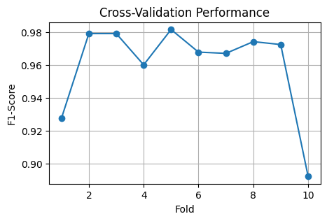

# Fraud Detection - Transact Elite
## 1. Business Problem
TransactElite is an innovative financial company specializing in providing advanced credit card solutions. I was hired to lead the development efforts of a Fraud Detection model aimed at combating fraudulent transactions with TransactElite's credit card clientele.

This work aims to explore advanced data modeling strategies and machine learning algorithms, with the goal of creating a robust and efficient fraud detection system, ensuring the security and reliability of financial transactions.

The data used to development this project can be found [here](https://www.kaggle.com/datasets/kelvinkelue/credit-card-fraud-prediction).
## 2. Business Assumptions
* Solution to be deliverable as a Python class in both .ipynb and .py formats
* Test 3 different machine learning algorithms
* Apply a overfitting evaluation in a cross-validation report
 
## 3. Solution Strategy

The solution was based upon the following strategy:

__Step 1 - Data Description__: visualize data information and use descriptive statistics to identify important or ususual behaviours in the data.

__Step 2 - Data Cleaning__: the process of identifying and correcting errors, inconsistencies, and inaccuracies within data.

__Step 3 - Feature Engeering__: create or derive new variables to help better understand the phenomenon or to improve model performance.

__Step 4 - Feature Selection__: select the features that contain the main information and attributes requeried from the model to learn the the data's behaviour.

__Step 5 - Data Preparation__: use techniques to better prepare the data to the machine learning model.

__Step 6 - Machine Learning Modelling__: machine learning model training and performance comparasion, using cross-validation report and overfitting evalution.

__Step 7 - Financial Impact Report__: find out what is the financial impact if the model is implemented to detect frauds in credit card transactions.

__Step 8 - Object-Orientated Devolpment__: structure and development the whole machine learning pipeline as a class with methods and attributes.
## 4. Machine Learning Models
The following algorithms were tested:

* [k-Nearest Neighbours](https://scikit-learn.org/stable/modules/generated/sklearn.neighbors.KNeighborsClassifier.html)
* [Random Forest Classifier](https://scikit-learn.org/stable/modules/generated/sklearn.ensemble.RandomForestClassifier.html#sklearn-ensemble-randomforestclassifier)
* [Gradient Boosting Classifier](https://scikit-learn.org/stable/modules/generated/sklearn.ensemble.GradientBoostingClassifier.html)

[F1-Score](https://scikit-learn.org/stable/modules/generated/sklearn.metrics.f1_score.html) was elected the main metric of performance evaluation.

The models were trained after running a 10 fold cross validation 10 splits in the full dataset. For each fold, a overfitting potencial was calculated as the difference between the train score and the test score. A threshold must be set as a parameter to define the overfitting potencial. 

As a result, the cross-validation report shows the overffitting potencial por each fold, a line graph with the test score for each fold and a dataframe with the algorithm's name, its main hyperparameters and the final F1-Score (using the full dataset).
## 5. Machine Learning Performance
The k-NN showed significant signs of possible overfitting across multiple folds of cross-validation, rendering it rejectable.

On the other hand, the Random Forest Classifier, although not exhibiting potential signs of overfitting in the cross-validation report under a threshold of 0.2, the model's performance at the end, with an 1 F1-Score - a perfect score, may indicate that the model is overly fitting to the training data, either due to default (unoptimized) parameters or the need for a larger volume of data, as the training dataset was reduced due to undersampling.

Therefore, the __Gradient Boosting Classifier__ has been chosen as the champion model. The Gradient Boosting Classifier is a model that builds a set of weak prediction models, usually shallow decision trees, iteratively. It works by constructing decision trees in a sequence, where each tree attempts to correct the errors of the previous models.

**Model's final performance**:

Fold 1: No sign of overfitting \
Fold 2: No sign of overfitting \
Fold 3: No sign of overfitting \
Fold 4: No sign of overfitting \
Fold 5: No sign of overfitting \
Fold 6: No sign of overfitting \
Fold 7: No sign of overfitting \
Fold 8: No sign of overfitting \
Fold 9: No sign of overfitting \
Fold 10: No sign of overfitting

| Model Champion |  n_estimators  |   learning_rate  |  max_depth  |  Final F1-Score  |
|--------------|---------|-----------|----------|-----------|
|   GradientBoostingClassifier    | 100 |  0.1  | 3  |  0.988  |

## 6. Financial Impact Report

Without the fraud detection model, the cost of covering fraudulent transactions was $1.133.324,68 (true positives). 

If the model was implemented, we would save approximately $1.132.325,80, with about $998,88 in costs due to failures (false negatives).

Therefore, the return on investment (ROI) would be $113.259,54%.
## 7. Conclusion
At the end of the development, we can conclude that the model is ready to serve as a tool to support decisions and actions aimed at combating and preventing fraud in credit card transactions, providing precise identification of transactions that are characterized as fraudulent.

## 8. To Be Improved

* __Data balancing method__: test the application of Oversampling or a blend /
* __Enhance variable selection__: adopt a more statistically oriented method
* __Fine-tune hyperparameter adjustment__: improve modeling through better hyperparameter selection
* __Gather more data__: increase the volume of historical data

## 🔗 Links

